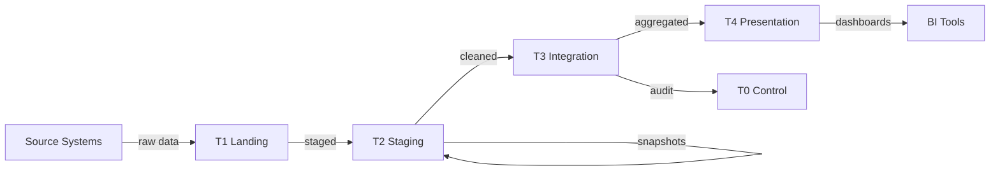

# Data Flow Diagrams (DFD)

Data Flow Diagrams visually map how data moves through a system — showing sources, processes, stores, and data flows. Essential for system design, pipeline documentation, and stakeholder communication.

## DFD Components

| Symbol | Name | Meaning |
|--------|------|---------|
| Rectangle | **External Entity** | Source or destination outside the system (user, API, external service) |
| Rounded rectangle / Circle | **Process** | Transforms or routes data (ETL job, dbt model, API endpoint) |
| Open rectangle (two lines) | **Data Store** | Where data rests (database, file, S3 bucket, Kafka topic) |
| Arrow | **Data Flow** | Direction of data movement, labelled with what flows |

## DFD Levels

### Level 0 — Context Diagram

The entire system as a single process with external entities:

```
┌──────────┐                              ┌──────────┐
│  Source   │──── raw transactions ───────▶│  Data    │──── dashboards ───▶ Analysts
│  Systems  │                              │ Platform │
│ (ERP,CRM) │◀──── API requests ──────────│          │
└──────────┘                              └──────────┘
```

One process box, all external actors, high-level data flows. **No internal detail.**

### Level 1 — Major Subsystems

Decompose the single process into major components:

```
┌──────────┐     raw data     ┌──────────┐    cleaned    ┌──────────┐
│  Source   │────────────────▶│ Ingestion │─────────────▶│  Storage  │
│  Systems  │                 │  (Fivetran)│              │  (T1/T2)  │
└──────────┘                 └──────────┘              └─────┬──────┘
                                                             │
                                                      staged data
                                                             │
                              ┌──────────┐              ┌────▼─────┐
                              │  Serving  │◀────────────│Transform │
                              │  (T4)    │  dims/facts  │  (dbt)   │
                              └─────┬────┘              └──────────┘
                                    │
                              dashboards
                                    │
                              ┌─────▼────┐
                              │ Analysts  │
                              └──────────┘
```

### Level 2 — Process Detail

Decompose a Level 1 process further:

```
Transform (dbt):
  ┌─────────────┐    staging    ┌─────────────┐    dims     ┌──────────────┐
  │ T2 Staging  │─────────────▶│  Dimensions  │───────────▶│    Facts      │
  │ (tbl_stg_*) │              │ (tbl_dim_*)  │            │ (tbl_fact_*)  │
  └─────────────┘              └─────────────┘            └──────┬───────┘
                                      │                          │
                                 SCD2 snapshots            presentation
                                      │                          │
                               ┌──────▼───────┐          ┌──────▼───────┐
                               │  Snapshot DB  │          │  T4 Views    │
                               │  (T2)         │          │  (vw_*)      │
                               └──────────────┘          └──────────────┘
```

## DFD for a Data Platform

### Example: Logistics Analytics Platform

```
                    ┌───────────────────────────────────────────────────────┐
                    │                   DATA PLATFORM                       │
                    │                                                       │
┌──────────┐       │  ┌─────────┐   ┌──────┐   ┌──────┐   ┌──────────┐  │
│  Source   │──raw──│─▶│   T1    │──▶│  T2  │──▶│  T3  │──▶│    T4    │──│──▶ BI Tools
│  Systems  │       │  │ Landing │   │Staging│   │ Marts│   │ Present. │  │
└──────────┘       │  └─────────┘   └──────┘   └──────┘   └──────────┐  │
                    │       │            │           │           │        │
┌──────────┐       │  ┌────▼────────────▼───────────▼───────────▼────┐  │
│  Fivetran │──────│─▶│                T0 Control                     │  │
│           │       │  │  (Audit, Security, Job Control, Monitoring)  │  │
└──────────┘       │  └──────────────────────────────────────────────┘  │
                    │                                                       │
                    └───────────────────────────────────────────────────────┘
```

## When to Use DFDs

| Situation | Why DFD Helps |
|-----------|--------------|
| **New pipeline design** | Align team on data flow before coding |
| **Documentation** | Show non-technical stakeholders how data moves |
| **Troubleshooting** | Trace where data goes wrong |
| **Security review** | Identify where sensitive data flows and who accesses it |
| **Onboarding** | New team members understand the system quickly |

## DFD Rules

1. **Every process must have at least one input and one output** — no black holes or miracles
2. **Data stores can't communicate directly** — data must flow through a process
3. **External entities can't communicate directly** — must flow through the system
4. **Label all flows** — name what data moves, not just that it moves
5. **Number processes** — for reference across levels (1.0, 1.1, 1.2)
6. **Decompose, don't add** — Level 2 details what Level 1 summarised; no new external entities

## Tools for Creating DFDs

| Tool | Type | Best For |
|------|------|----------|
| **Mermaid** | Code-based (in markdown) | Obsidian, GitHub, docs-as-code |
| **draw.io / diagrams.net** | Visual editor | Quick diagrams, free |
| **Lucidchart** | SaaS visual editor | Team collaboration |
| **PlantUML** | Code-based | CI-generated diagrams |

### Mermaid Example (Obsidian-compatible)


