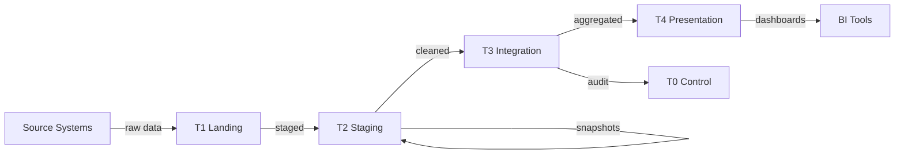
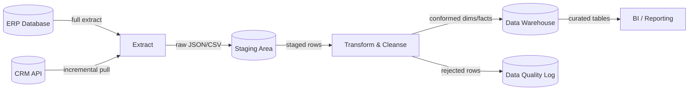
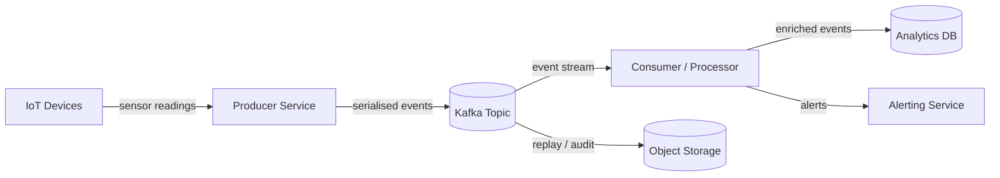
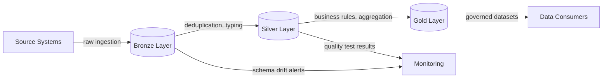
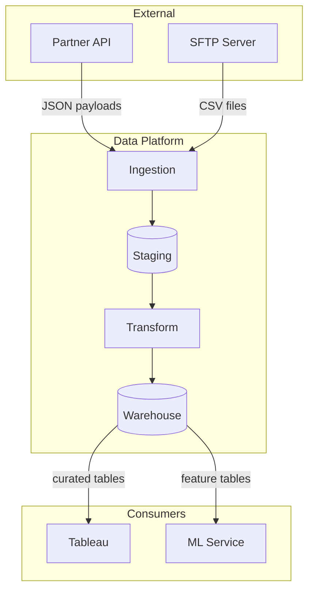
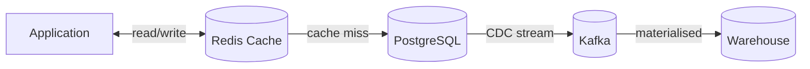

# Data Flow Diagrams (DFD)

Data Flow Diagrams visually map how data moves through a system — showing sources, processes, stores, and data flows. Essential for system design, pipeline documentation, and stakeholder communication.

## DFD Components

| Symbol | Name | Meaning |
|--------|------|---------|
| Rectangle | **External Entity** | Source or destination outside the system (user, API, external service) |
| Rounded rectangle / Circle | **Process** | Transforms or routes data (ETL job, dbt model, API endpoint) |
| Open rectangle (two lines) | **Data Store** | Where data rests (database, file, S3 bucket, Kafka topic) |
| Arrow | **Data Flow** | Direction of data movement, labelled with what flows |

## DFD Levels

### Level 0 — Context Diagram

The entire system as a single process with external entities:

```
┌──────────┐                              ┌──────────┐
│  Source   │──── raw transactions ───────▶│  Data    │──── dashboards ───▶ Analysts
│  Systems  │                              │ Platform │
│ (ERP,CRM) │◀──── API requests ──────────│          │
└──────────┘                              └──────────┘
```

One process box, all external actors, high-level data flows. **No internal detail.**

### Level 1 — Major Subsystems

Decompose the single process into major components:

```
┌──────────┐     raw data     ┌──────────┐    cleaned    ┌──────────┐
│  Source   │────────────────▶│ Ingestion │─────────────▶│  Storage  │
│  Systems  │                 │  (Fivetran)│              │  (T1/T2)  │
└──────────┘                 └──────────┘              └─────┬──────┘
                                                             │
                                                      staged data
                                                             │
                              ┌──────────┐              ┌────▼─────┐
                              │  Serving  │◀────────────│Transform │
                              │  (T4)    │  dims/facts  │  (dbt)   │
                              └─────┬────┘              └──────────┘
                                    │
                              dashboards
                                    │
                              ┌─────▼────┐
                              │ Analysts  │
                              └──────────┘
```

### Level 2 — Process Detail

Decompose a Level 1 process further:

```
Transform (dbt):
  ┌─────────────┐    staging    ┌─────────────┐    dims     ┌──────────────┐
  │ T2 Staging  │─────────────▶│  Dimensions  │───────────▶│    Facts      │
  │ (tbl_stg_*) │              │ (tbl_dim_*)  │            │ (tbl_fact_*)  │
  └─────────────┘              └─────────────┘            └──────┬───────┘
                                      │                          │
                                 SCD2 snapshots            presentation
                                      │                          │
                               ┌──────▼───────┐          ┌──────▼───────┐
                               │  Snapshot DB  │          │  T4 Views    │
                               │  (T2)         │          │  (vw_*)      │
                               └──────────────┘          └──────────────┘
```

## DFD for a Data Platform

### Example: Logistics Analytics Platform

```
                    ┌───────────────────────────────────────────────────────┐
                    │                   DATA PLATFORM                       │
                    │                                                       │
┌──────────┐       │  ┌─────────┐   ┌──────┐   ┌──────┐   ┌──────────┐  │
│  Source   │──raw──│─▶│   T1    │──▶│  T2  │──▶│  T3  │──▶│    T4    │──│──▶ BI Tools
│  Systems  │       │  │ Landing │   │Staging│   │ Marts│   │ Present. │  │
└──────────┘       │  └─────────┘   └──────┘   └──────┘   └──────────┐  │
                    │       │            │           │           │        │
┌──────────┐       │  ┌────▼────────────▼───────────▼───────────▼────┐  │
│  Fivetran │──────│─▶│                T0 Control                     │  │
│           │       │  │  (Audit, Security, Job Control, Monitoring)  │  │
└──────────┘       │  └──────────────────────────────────────────────┘  │
                    │                                                       │
                    └───────────────────────────────────────────────────────┘
```

## When to Use DFDs

| Situation | Why DFD Helps |
|-----------|--------------|
| **New pipeline design** | Align team on data flow before coding |
| **Documentation** | Show non-technical stakeholders how data moves |
| **Troubleshooting** | Trace where data goes wrong |
| **Security review** | Identify where sensitive data flows and who accesses it |
| **Onboarding** | New team members understand the system quickly |

## DFD Rules

1. **Every process must have at least one input and one output** — no black holes or miracles
2. **Data stores can't communicate directly** — data must flow through a process
3. **External entities can't communicate directly** — must flow through the system
4. **Label all flows** — name what data moves, not just that it moves
5. **Number processes** — for reference across levels (1.0, 1.1, 1.2)
6. **Decompose, don't add** — Level 2 details what Level 1 summarised; no new external entities

## Tools for Creating DFDs

| Tool | Type | Best For |
|------|------|----------|
| **Mermaid** | Code-based (in markdown) | Obsidian, GitHub, docs-as-code |
| **draw.io / diagrams.net** | Visual editor | Quick diagrams, free |
| **Lucidchart** | SaaS visual editor | Team collaboration |
| **PlantUML** | Code-based | CI-generated diagrams |

### Mermaid Example (Obsidian-compatible)



## DFD Notation Systems

Two dominant notation standards exist. Both express the same semantics but differ visually.

### Gane-Sarson vs Yourdon-DeMarco

| Element | Gane-Sarson | Yourdon-DeMarco |
|---------|------------|-----------------|
| **Process** | Rounded rectangle with ID stripe at top | Circle |
| **Data Store** | Open-ended rectangle with ID on left | Two parallel lines with label between |
| **External Entity** | Square / rectangle | Square / rectangle (same) |
| **Data Flow** | Labelled arrow | Labelled arrow (same) |

Gane-Sarson is more common in enterprise and data engineering contexts because the rounded rectangles give more room for descriptive labels. Yourdon-DeMarco is favoured in academic settings and software engineering textbooks.

> [!tip] Practical Choice
> For data engineering documentation, Gane-Sarson notation tends to be clearer — the rectangular process shapes accommodate longer names like "Fivetran Incremental Sync" or "dbt Staging Transform" more comfortably than circles.

## Batch ETL Pipeline DFD

A classic extract-transform-load pipeline expressed as a DFD:



Key points:
- The **Extract** process has two external entity sources (ERP, CRM) — each flow is labelled with its extraction strategy
- **Rejected rows** branch to a data quality log — never silently discard data
- The **Staging Area** acts as a buffer data store between extract and transform

## Streaming Pipeline DFD

Streaming architectures follow a different pattern — continuous data flow with no batch boundaries:



Notable differences from batch DFDs:
- The **broker** (Kafka topic) is a data store, not a process — it holds data at rest, even if briefly
- **Multiple consumers** can read from the same topic independently
- **Object storage** as a secondary sink enables replay and audit

## Medallion Architecture DFD

The [[Data Flow Diagrams|medallion pattern]] (bronze/silver/gold) maps naturally to DFD levels:



| Medallion Layer | DFD Role | Typical Contents |
|----------------|----------|-----------------|
| **Bronze** | Data store (raw) | Append-only, source-faithful, minimal transformation |
| **Silver** | Data store (cleansed) | Deduplicated, typed, validated, conformed |
| **Gold** | Data store (curated) | Business-level aggregations, dimension/fact tables |

Each transition between layers is a **process** — the DFD makes explicit what transformations occur at each boundary.

## Mermaid DFD Patterns for Obsidian

Mermaid's `flowchart` directive is the best fit for DFDs in Obsidian. Some useful patterns:

### Subgraphs for System Boundaries



### Bidirectional Flows



> [!info] Mermaid Limitations
> Mermaid does not natively support Gane-Sarson or Yourdon-DeMarco shapes. Use `[( )]` for data stores (cylinder), `[ ]` for processes (rectangle), and subgraphs for system boundaries. The semantics are preserved even if the exact notation differs.

## Common DFD Mistakes

| Mistake | Why It Matters | Fix |
|---------|---------------|-----|
| **Crossing levels** — showing Level 2 detail inside a Level 0 diagram | Overwhelms readers, defeats the purpose of decomposition | Keep each diagram at one level; reference child diagrams by process number |
| **Missing data stores** — arrows going directly between processes | Implies synchronous coupling that may not exist; hides where data rests | Add intermediate stores (staging tables, queues, files) |
| **Unlabelled flows** — arrows with no description | Reader cannot tell *what* data moves, only *that* something moves | Always label with the data content: "order records", "daily aggregates" |
| **Data stores communicating directly** — arrow from one store to another | Violates DFD rules; data cannot move without a process acting on it | Insert the process that reads from one store and writes to another |
| **Too many processes at one level** — more than 7-9 processes | Exceeds cognitive load; diagram becomes unreadable | Decompose into a child level diagram |
| **Forgetting error/reject flows** — only showing the happy path | Hides where data can be lost or corrupted | Add flows for rejected rows, dead-letter queues, error logs |

## DFDs vs Sequence Diagrams vs Architecture Diagrams

Each diagram type serves a different purpose. Choosing the wrong one leads to confusion or wasted effort.

| Aspect | DFD | [[Sequence Diagrams|Sequence Diagram]] | Architecture Diagram |
|--------|-----|------------------|----------------------|
| **Shows** | What data flows where | Order of interactions over time | System components and their relationships |
| **Axis** | No time axis — spatial layout | Vertical time axis | No time axis — spatial layout |
| **Best for** | Pipeline design, data lineage, stakeholder communication | API flows, debugging multi-step processes, protocol documentation | Infrastructure overview, deployment topology, technology choices |
| **Granularity** | Adjustable via levels (0/1/2) | Single level of detail | Usually one level |
| **Weakness** | Does not show ordering or timing | Does not show data at rest or storage | Does not show data content or flow detail |

### Decision Guide

- **"Where does the data go?"** — use a DFD
- **"In what order do the components talk?"** — use a [[Sequence Diagrams|sequence diagram]]
- **"What infrastructure do we need?"** — use an architecture diagram
- **"What transforms the data at each step?"** — use a DFD (Level 2)
- **"What happens when the API call fails?"** — use a [[Sequence Diagrams|sequence diagram]] with alt fragments
