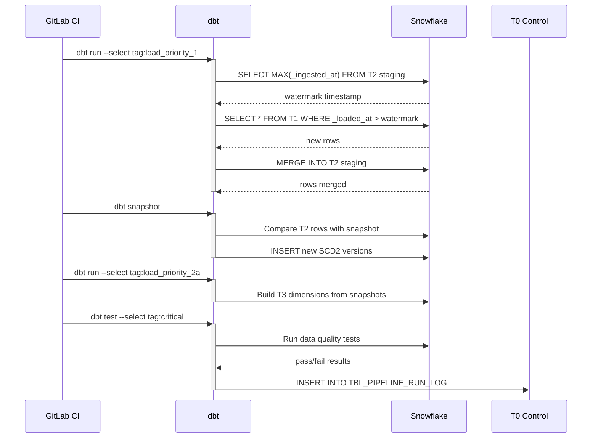
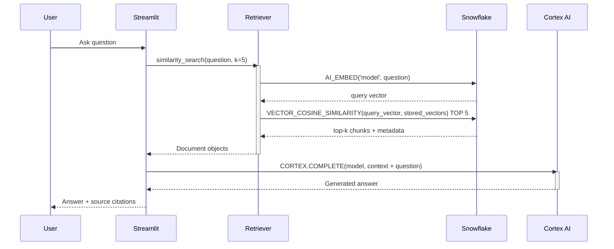
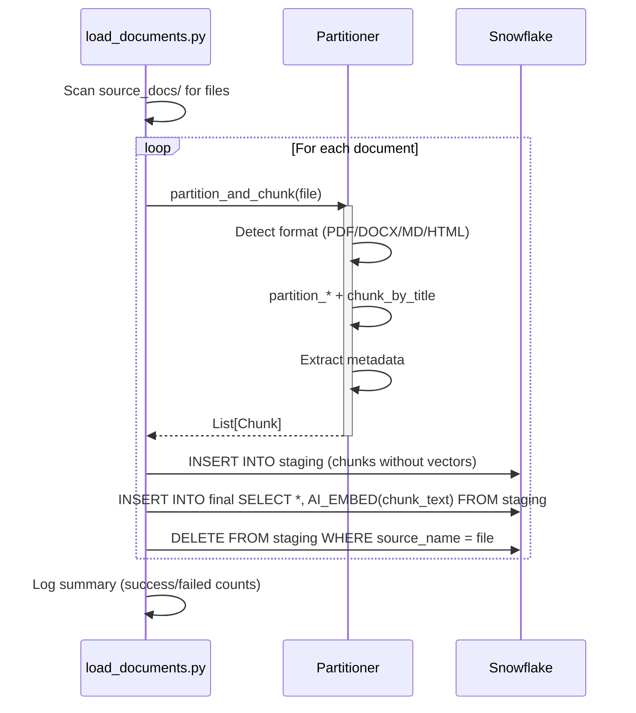
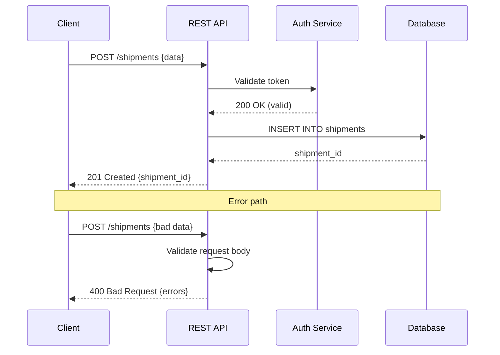
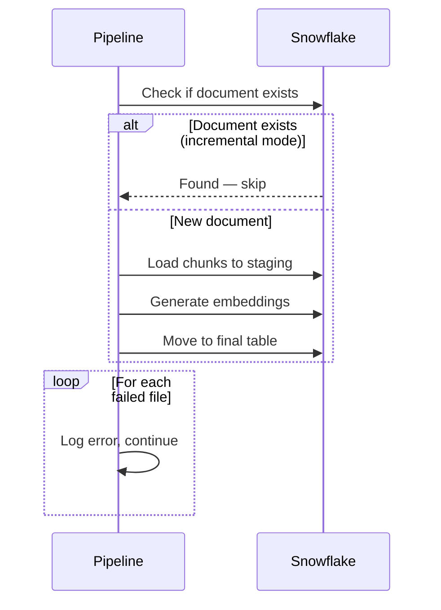
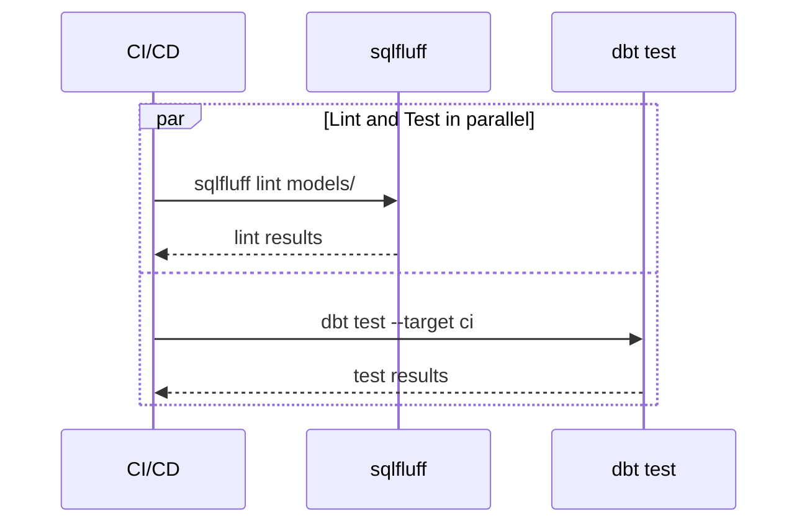

# Sequence Diagrams

Sequence diagrams show the order of interactions between components over time — essential for documenting APIs, pipelines, and multi-step processes.

## Core Elements

| Element | Symbol | Purpose |
|---------|--------|---------|
| **Participant** | Box at top | Actor or system component |
| **Lifeline** | Dashed vertical line | Time flowing downward |
| **Message** | Horizontal arrow | Interaction between participants |
| **Activation** | Narrow rectangle on lifeline | Period when participant is active |
| **Return** | Dashed arrow | Response to a message |
| **Note** | Rectangle with folded corner | Annotation |

## Data Pipeline Sequences

### Incremental dbt Pipeline

### RAG Query Flow

### Document Ingestion Flow

### API Request Sequence

## Message Types

| Arrow | Meaning |
|-------|---------|
| `→` (solid) | Synchronous message (caller waits) |
| `-->` (dashed) | Return / response |
| `->>`  (solid, open head) | Asynchronous message (fire and forget) |
| `-->>` (dashed, open head) | Async response |

## Advanced Elements

### Alt / Opt / Loop Fragments

### Parallel Execution

## When to Use Sequence Diagrams

| Situation | Why |
|-----------|-----|
| **API design** | Document request/response flow before implementation |
| **Pipeline debugging** | Trace the exact order of operations |
| **Integration documentation** | Show how services interact |
| **Error flow documentation** | Map what happens when things fail |
| **Onboarding** | Explain multi-step processes visually |

## Tools

| Tool | Format | Integration |
|------|--------|-------------|
| **Mermaid** | Markdown code blocks | Obsidian, GitHub, GitLab, Notion |
| **PlantUML** | Text-based DSL | IntelliJ, VS Code, CI pipelines |
| **draw.io** | Visual drag-and-drop | Confluence, standalone |
| **Lucidchart** | Visual SaaS | Team collaboration |
| **swimlanes.io** | Text-based, web | Quick browser-based diagrams |

Mermaid is recommended for this vault — renders natively in Obsidian.
