# Sequence Diagrams

Sequence diagrams show the order of interactions between components over time — essential for documenting APIs, pipelines, and multi-step processes.

## Core Elements

| Element | Symbol | Purpose |
|---------|--------|---------|
| **Participant** | Box at top | Actor or system component |
| **Lifeline** | Dashed vertical line | Time flowing downward |
| **Message** | Horizontal arrow | Interaction between participants |
| **Activation** | Narrow rectangle on lifeline | Period when participant is active |
| **Return** | Dashed arrow | Response to a message |
| **Note** | Rectangle with folded corner | Annotation |

## Data Pipeline Sequences

### Incremental dbt Pipeline

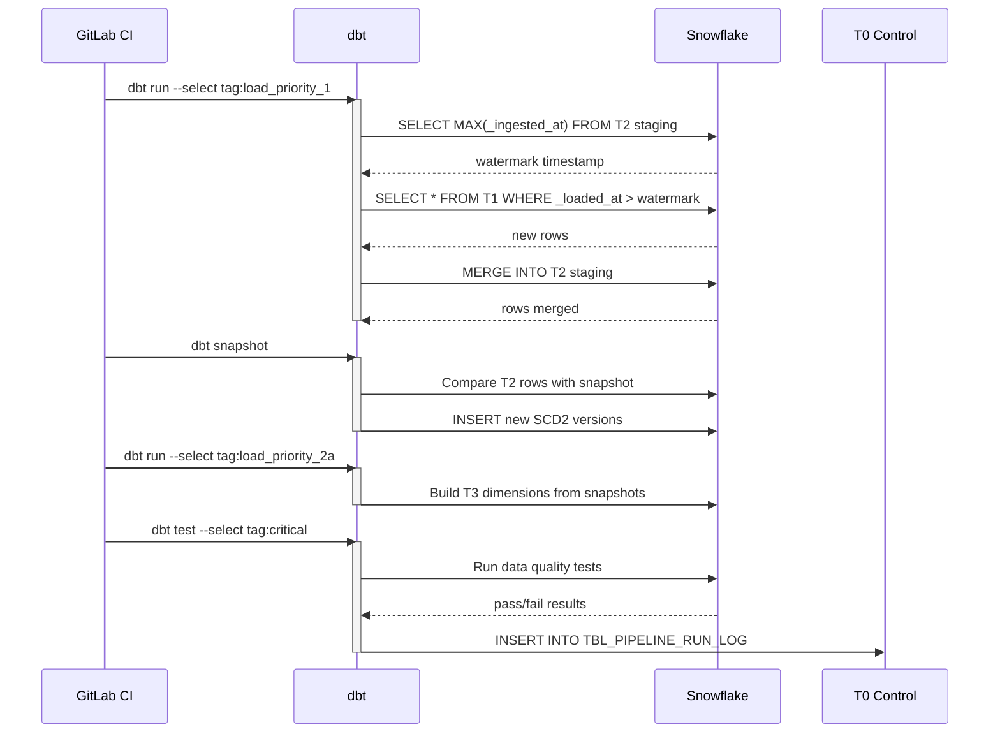

### RAG Query Flow

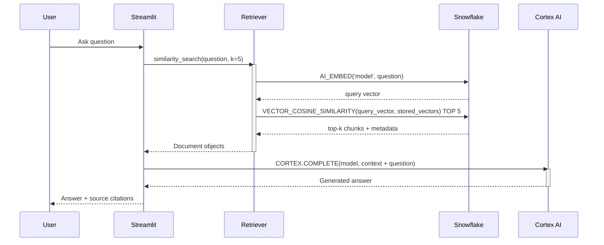

### Document Ingestion Flow

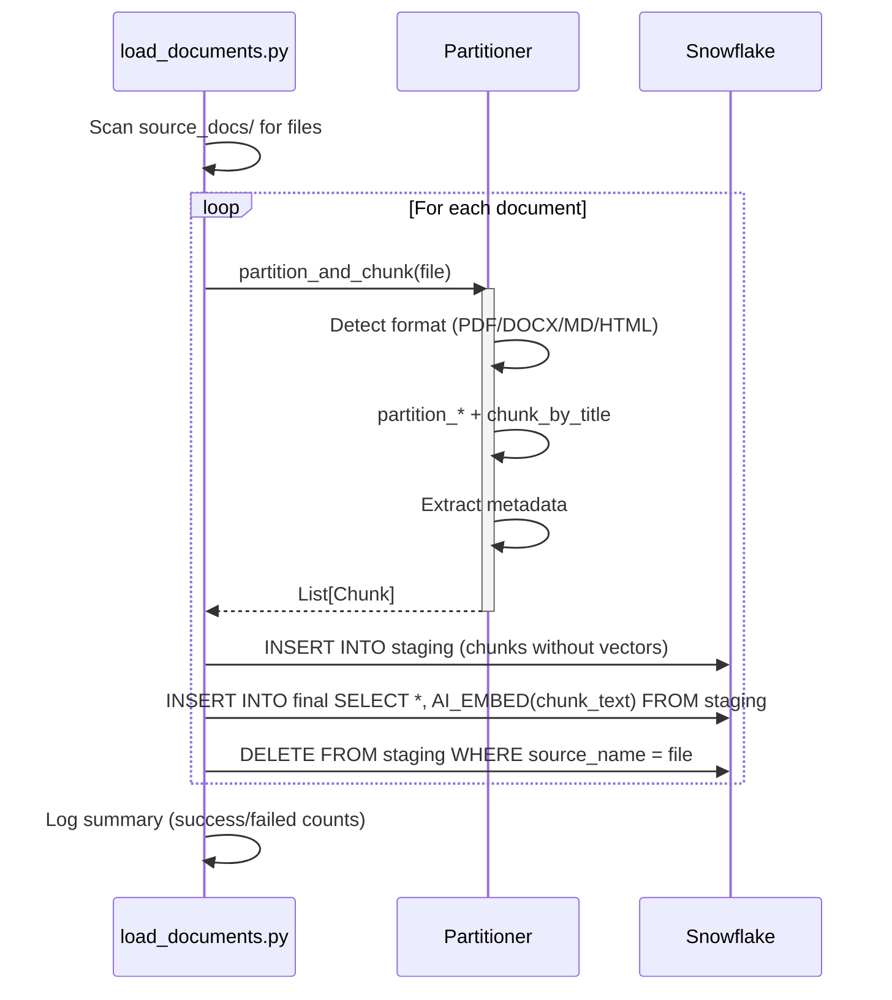

### API Request Sequence

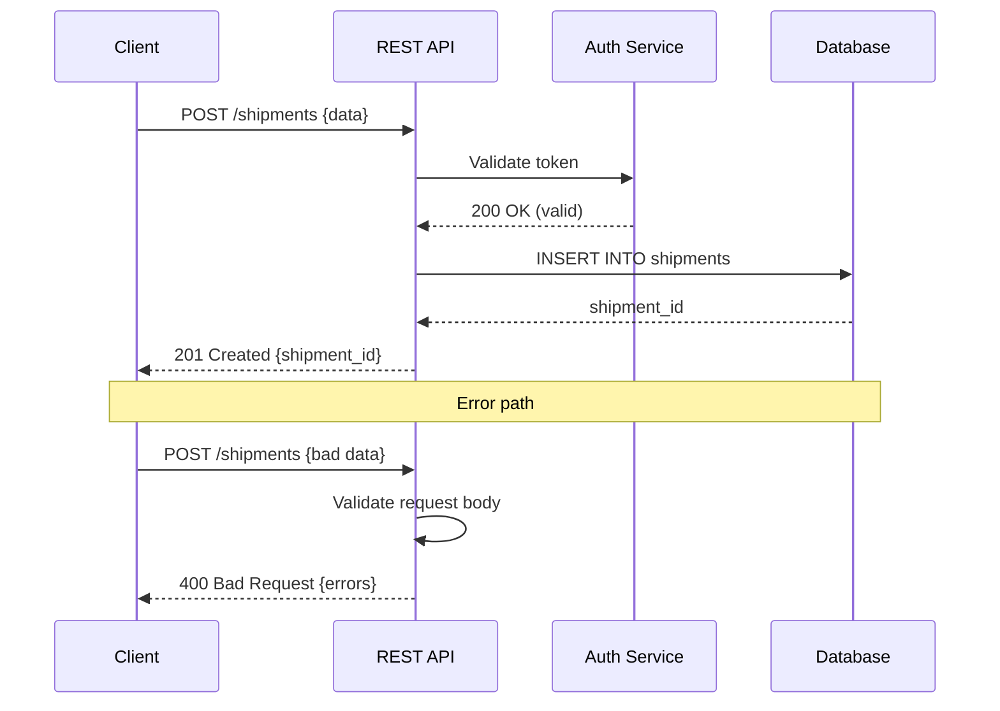

## Message Types

| Arrow | Meaning |
|-------|---------|
| `→` (solid) | Synchronous message (caller waits) |
| `-->` (dashed) | Return / response |
| `->>`  (solid, open head) | Asynchronous message (fire and forget) |
| `-->>` (dashed, open head) | Async response |

## Advanced Elements

### Alt / Opt / Loop Fragments

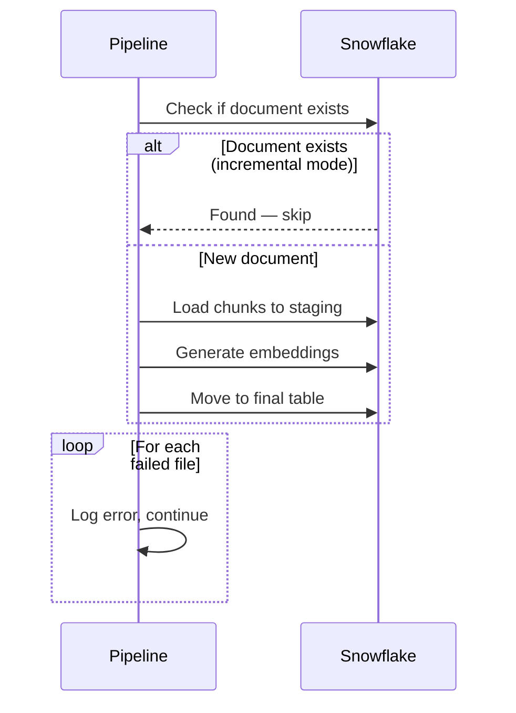

### Parallel Execution

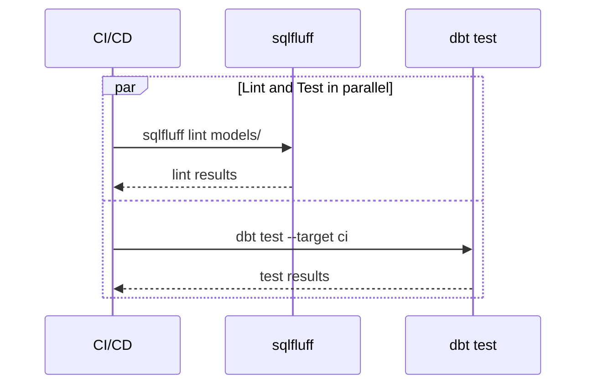

## When to Use Sequence Diagrams

| Situation | Why |
|-----------|-----|
| **API design** | Document request/response flow before implementation |
| **Pipeline debugging** | Trace the exact order of operations |
| **Integration documentation** | Show how services interact |
| **Error flow documentation** | Map what happens when things fail |
| **Onboarding** | Explain multi-step processes visually |

## Tools

| Tool | Format | Integration |
|------|--------|-------------|
| **Mermaid** | Markdown code blocks | Obsidian, GitHub, GitLab, Notion |
| **PlantUML** | Text-based DSL | IntelliJ, VS Code, CI pipelines |
| **draw.io** | Visual drag-and-drop | Confluence, standalone |
| **Lucidchart** | Visual SaaS | Team collaboration |
| **swimlanes.io** | Text-based, web | Quick browser-based diagrams |

Mermaid is recommended for this vault — renders natively in Obsidian.

## Notation Deep Dive

### Actors and Participants

In Mermaid sequence diagrams, `participant` creates a box and `actor` creates a stick figure. Use `actor` for human roles and `participant` for system components:

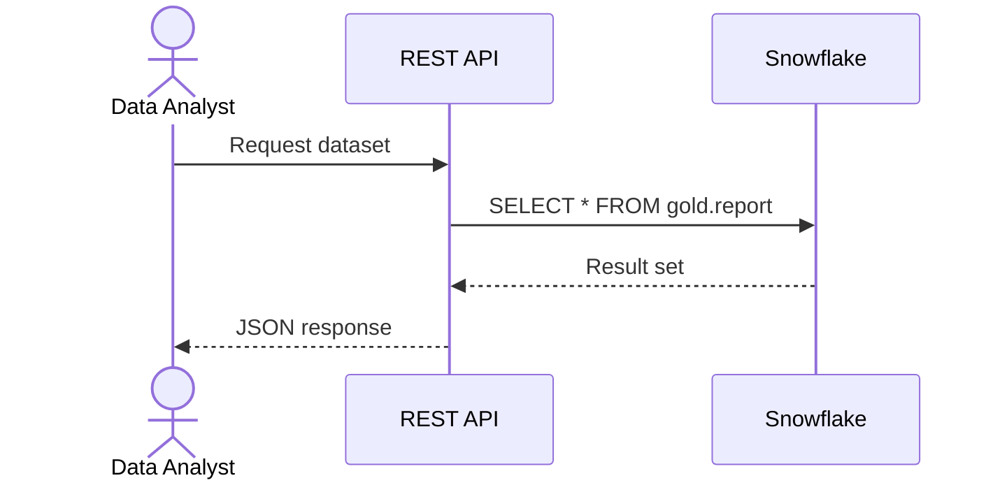

### Synchronous vs Asynchronous Messages

| Syntax | Rendering | Semantics |
|--------|-----------|-----------|
| `->>` | Solid line, filled arrowhead | Synchronous — caller blocks until response |
| `-->>` | Dashed line, filled arrowhead | Return / response message |
| `-)` | Solid line, open arrowhead | Asynchronous — fire and forget |
| `--)` | Dashed line, open arrowhead | Async response / callback |

Asynchronous messages are critical for modelling event-driven and streaming architectures where the producer does not wait for the consumer.

### Activation Bars

Activation bars (the narrow rectangles on lifelines) show when a participant is actively processing. Use `activate` / `deactivate` or the shorthand `+` / `-` syntax:

```
Caller->>+Service: request
Service-->>-Caller: response
```

### Combined Fragments

| Fragment | Purpose | Data Engineering Use Case |
|----------|---------|--------------------------|
| `alt` / `else` | Conditional branching | Incremental vs full load decision |
| `opt` | Optional execution | Skip processing if no new data |
| `loop` | Repeated execution | Paginated API calls, batch iteration |
| `par` / `and` | Parallel execution | Concurrent pipeline stages |
| `critical` | Atomic section | Transaction boundaries |
| `break` | Exit early | Circuit breaker tripped |

## REST API Pagination Flow

A common data engineering pattern — extracting all pages from a paginated API:

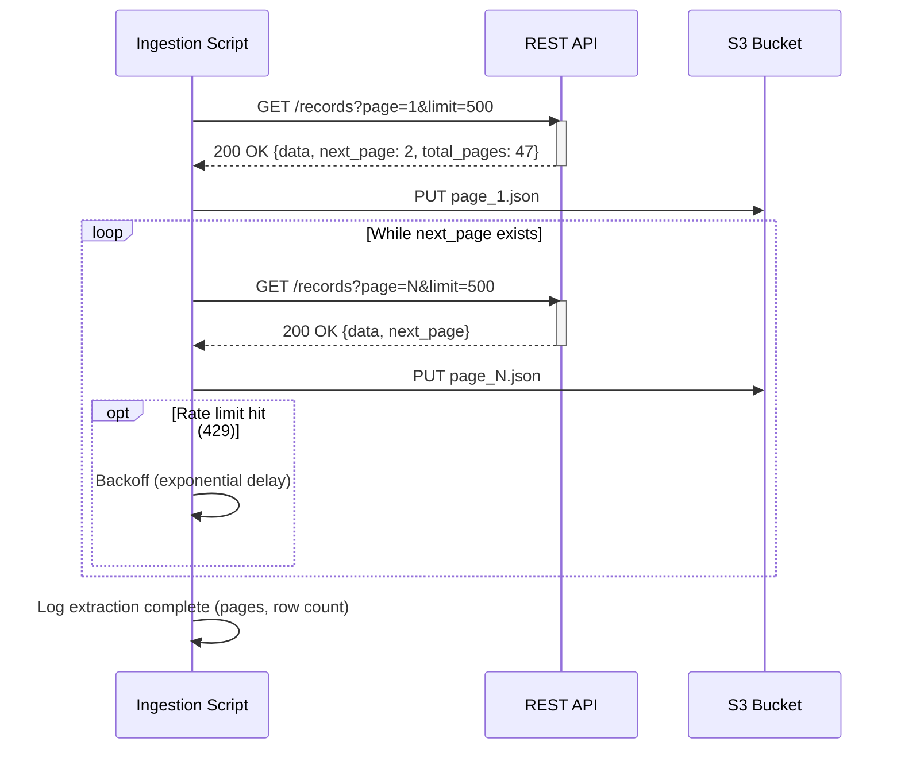

Key details this diagram captures:
- The **loop fragment** makes the pagination strategy explicit
- The **opt fragment** documents rate-limit handling without cluttering the main flow
- Raw files land in **S3** before any transformation — separation of concerns

## dbt Run Orchestration Flow

How an orchestrator coordinates a full dbt pipeline run with logging:

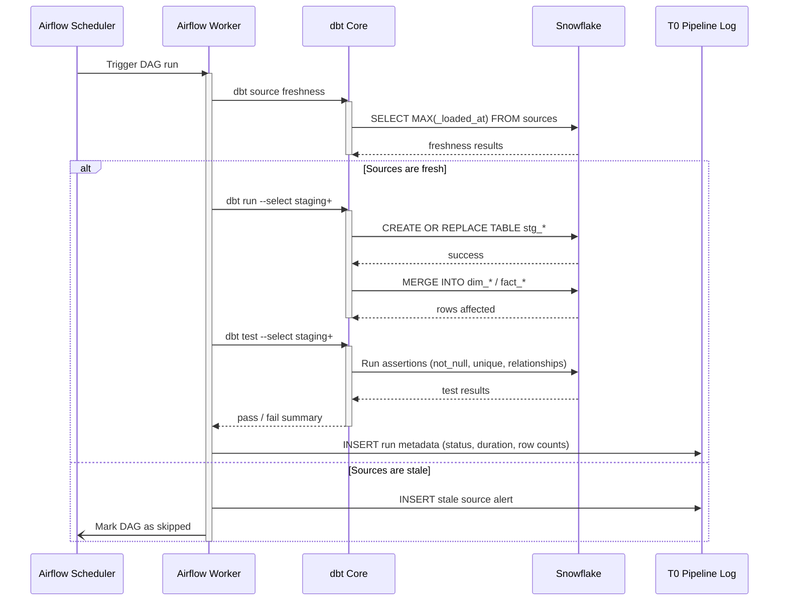

## Kafka Producer-Consumer Flow

Modelling asynchronous message passing through a broker:

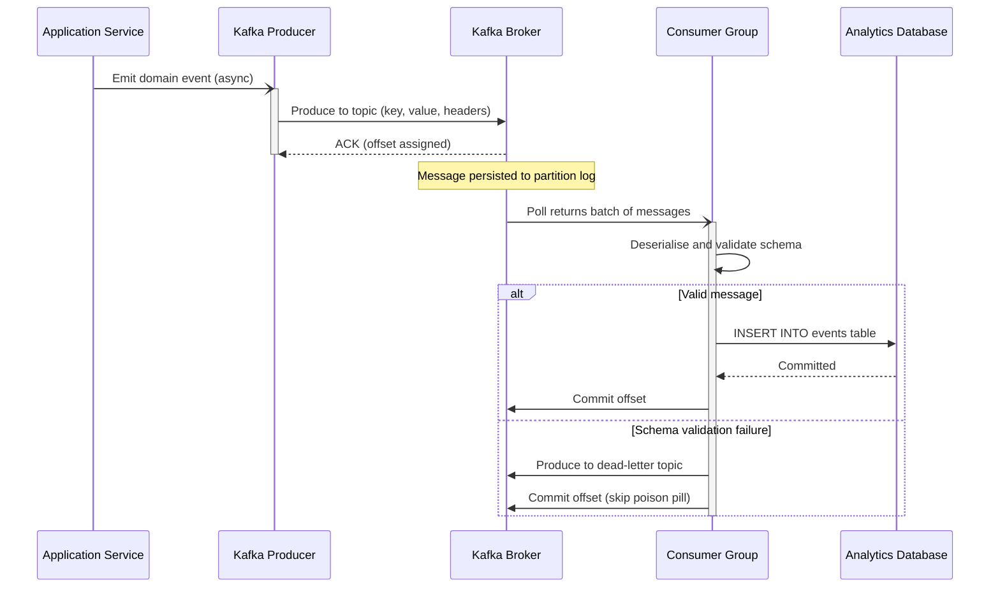

Notable modelling choices:
- The initial `App-)Prod` uses an **async arrow** — the application does not wait for Kafka acknowledgement
- The **dead-letter topic** pattern is shown via the `alt` fragment — critical for production pipelines
- **Offset commits** are explicit — this documents the at-least-once delivery guarantee

## CI/CD Deployment Flow

A typical data engineering CI/CD pipeline from git push to production:

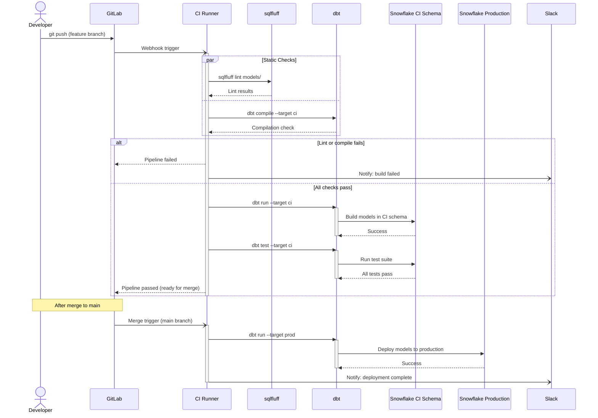

## When to Use Sequence Diagrams in Data Engineering

Sequence diagrams excel in specific documentation scenarios. Choosing the right diagram type saves time and improves clarity.

### Strong Use Cases

| Scenario | Why Sequence Diagrams Work |
|----------|---------------------------|
| **API integration documentation** | Shows the exact request/response handshake, authentication flow, pagination, and error handling in order |
| **Troubleshooting production incidents** | Trace the timeline of what called what, when, and what failed — invaluable during post-mortems |
| **Onboarding new team members** | Multi-step orchestration flows (Airflow DAGs, CI/CD pipelines) are far clearer as sequences than as prose |
| **Contract negotiation with external teams** | Agree on interaction protocol before writing code — the diagram becomes the specification |
| **Async architecture documentation** | Kafka/pub-sub flows need the temporal ordering that [[Data Flow Diagrams|DFDs]] cannot express |

### When Not to Use Them

- **Data lineage** — use a [[Data Flow Diagrams|DFD]] instead; sequence diagrams do not show data at rest
- **Infrastructure topology** — use an architecture diagram; sequence diagrams do not show deployment concerns
- **Simple single-step operations** — a sequence diagram for "client calls API, gets response" adds no value over prose

### Tips for Effective Sequence Diagrams

1. **Limit participants to 5-7** — more than that and the diagram becomes unreadable; split into multiple diagrams
2. **Show the error path** — use `alt` fragments to document what happens when things fail, not just the happy path
3. **Label messages precisely** — "send data" is useless; "POST /api/v2/shipments {manifest_id, items[]}" is useful
4. **Use activation bars consistently** — they show processing duration and help identify bottlenecks
5. **Add notes for context** — `Note over` blocks explain *why* something happens without cluttering the message flow

---

## Error Handling and Retry Flows

### Pipeline Retry with Exponential Backoff

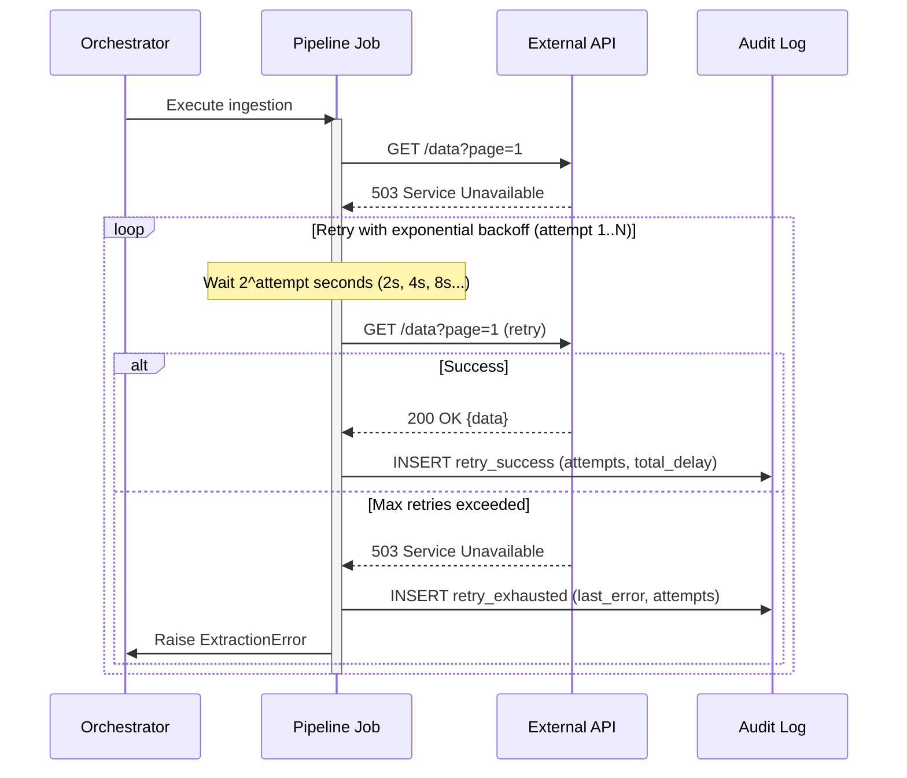

### Dead-Letter Queue Flow

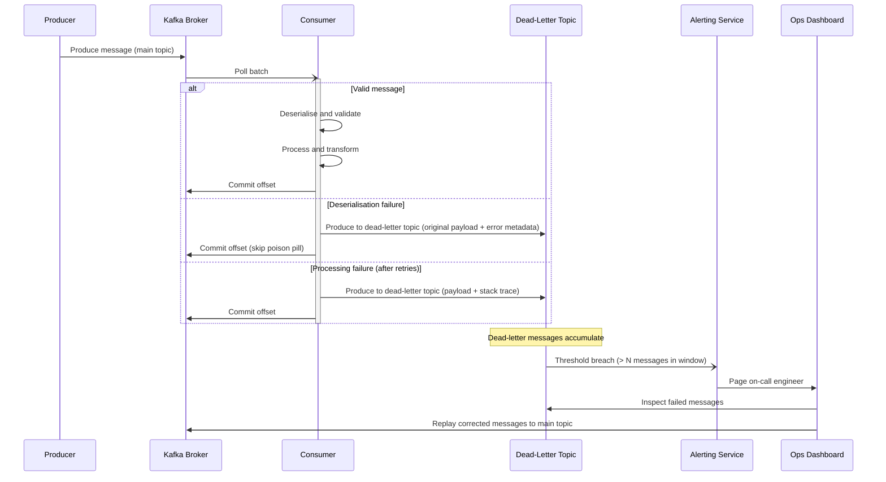

### Circuit Breaker State Transitions

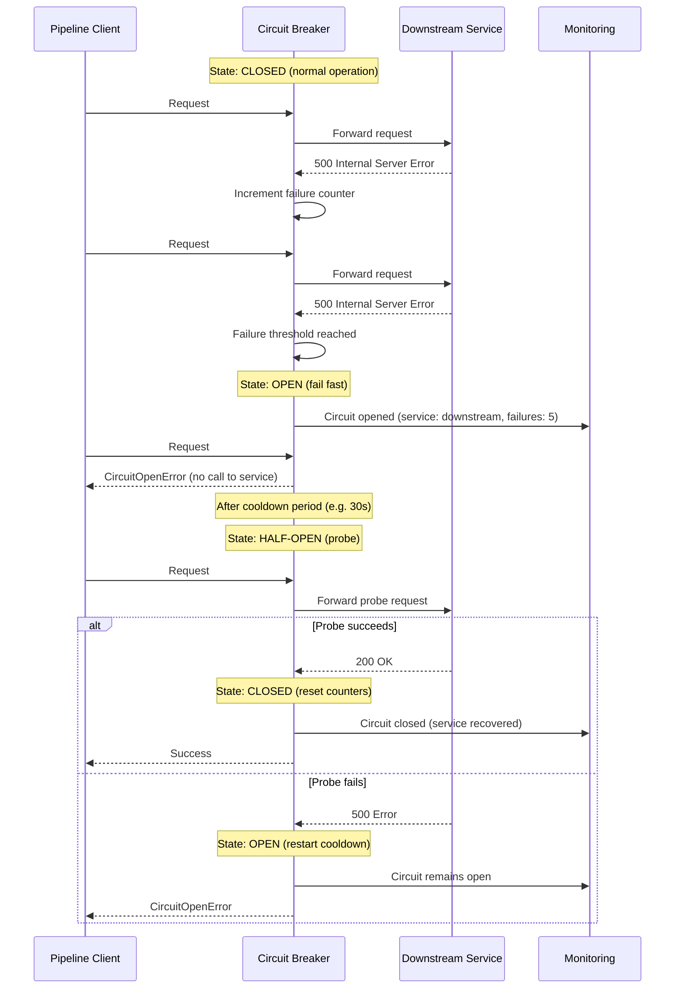

### Webhook Delivery with Signature Verification

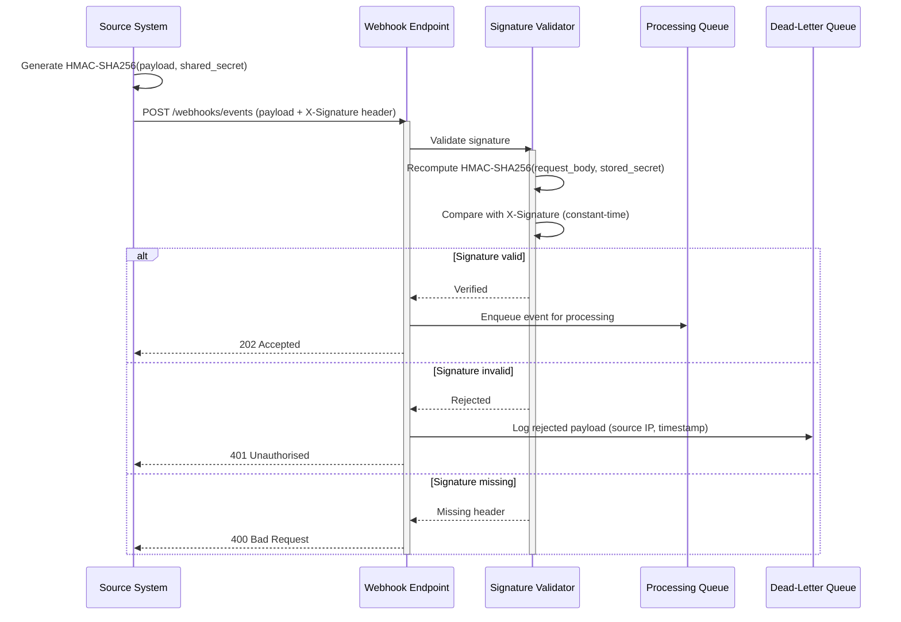
